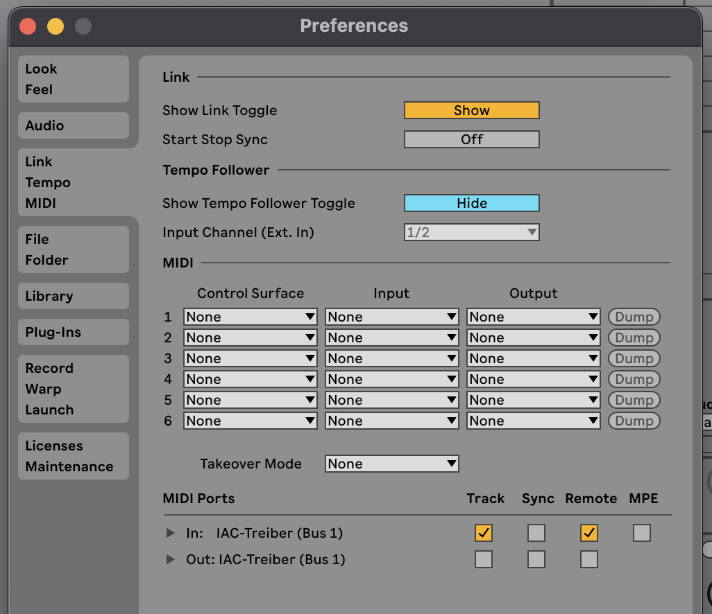

# Motion2MIDI

Control your DAW with hand movements using your webcam.

> **Note:** This repository is for distribution and feedback only. The source code is closed-source.

---

## 🎬 See It In Action

_Watch how Motion2MIDI transforms movements into MIDI control_

---

## 📦 Download

**Latest Release:** [Download Motion2MIDI v0.9.0-beta](https://github.com/froehlicht/motion2midi/releases/latest)

### macOS Apple Silicon (M1/M2/M3/M4)

- **[Download Motion2MIDI v0.9.0-beta](https://github.com/froehlicht/motion2midi/releases/download/v0.9.0-beta/Motion2MIDI_v0.9.0-beta.zip)** - Includes both AU and VST3

**Planned Support:**

- Intel Mac (coming soon)
- Windows (coming soon)

---

## 🎯 Features

- **Real-time hand tracking** using YOLO computer vision model
- **4 MIDI CC outputs** - Map left/right hand X/Y positions to any parameter
- **MIDI Map** - Assign any CC number per parameter
- **Mute/Solo controls** - Focus on specific parameters
- **Customizable visualization** - Toggle video feed, keypoints, skeleton, and control zones
- **Per-session settings** - Preferences saved with your DAW project
- **Automatic updates** - Get notified when new versions are available

---

## 🚀 Quick Start Guide

### 1. Installation

1. **Download** Motion2MIDI from [Releases](https://github.com/froehlicht/motion2midi/releases/latest)
2. **Unzip** the downloaded file
3. **Copy plugins to your plugin folder**:
    - **AU:** `~/Library/Audio/Plug-Ins/Components/Motion2MIDI.component`
    - **VST3:** `~/Library/Audio/Plug-Ins/VST3/Motion2MIDI.vst3`
4. **Restart your DAW**

### 2. Setup IAC Driver (macOS)

The IAC Driver creates a virtual MIDI bus for routing MIDI between applications.

#### How to activate the IAC Driver:

1. Open **Audio MIDI Setup** (Applications → Utilities → Audio MIDI Setup)
2. Go to **Window → Show MIDI Studio** (or press ⌘2)
3. Double-click the **IAC Driver** icon
4. Check **"Device is online"**

### 3. DAW Setup

#### In your DAW's MIDI Settings:

Enable the IAC Driver for MIDI input/output:

**Ableton Live:**

- Go to **Preferences → Link, Tempo & MIDI**
- Under **MIDI Ports**, enable:
    - **Track** (for IAC Driver) ✓
    - **Remote** (for IAC Driver) ✓

**FL Studio:**

- Go to **Options → MIDI Settings**
- Enable the IAC Driver in the input list
- Set **"Enable"** to ON

### 4. Load Motion2MIDI

1. **Load Motion2MIDI** 
2. **Select MIDI output** in the plugin → Choose **"IAC Driver Bus 1"**
3. **Grant camera permission** when prompted (System Settings → Privacy & Security → Camera)

### 5. MIDI Mapping

Motion2MIDI sends 4 MIDI CC parameters:

|Parameter|Default CC|Controls|
|---|---|---|
|LX|CC 11|Left hand horizontal position|
|LY|CC 12|Left hand vertical position|
|RX|CC 13|Right hand horizontal position|
|RY|CC 14|Right hand vertical position|

You can change the CC numbers using the **Learn** function.

---

## 🎛️ MIDI Mapping in Your DAW

### Ableton Live

1. **Enable MIDI Map Mode**:
    
    - Press **⌘M** (macOS) or **Ctrl+M** (Windows)
    - Or click the **MIDI** button in the top-right corner
2. **Select the parameter** you want to control in Ableton (e.g., filter cutoff, volume)
    
3. **In Motion2MIDI**: Click the **Map** button for the desired parameter (LX, LY, RX, or RY)
    
    - The plugin automatically sends a test MIDI signal
    - The parameter in Ableton will highlight and the mapping is established
4. **Deactivate Map** before selecting the next parameter, or the parameter will also be mapped to the current movement axis
    
5. **Exit MIDI Map Mode**: Press **⌘M** again
    

**Note:** Motion2MIDI automatically activates "No MIDI Singal Generation" during mapping to prevent unwanted parameter movements.

### FL Studio

1. **In Motion2MIDI**: Click the **Map** button for the desired parameter (LX, LY, RX, or RY)
    
    - The plugin sends constant MIDI signals with value 64 for linking
2. **In FL Studio**: Move the parameter you want to control (e.g., a knob or fader)
    
3. **Link the controller**:
    
    - Right-click the parameter
    - Select **Link to controller**
    - Or use: **Tools → Last tweaked → Link to controller**
4. **The connection is established**
    

**Note:** Motion2MIDI automatically activates "No Processing Mode" during mapping to prevent unwanted parameter movements.

### Other DAWs

> **TODO:** Mapping strategies for Logic Pro, Reaper, GarageBand, and other DAWs coming soon.
> 
> Most DAWs support standard MIDI Learn functionality. The general process is:
> 
> 1. Activate MIDI Learn in your DAW
> 2. Click the parameter you want to control
> 3. Click the **MAP** button in Motion2MIDI
> 4. Deactivate the MAP button before selecting the next parameter in your DAW
> 
> If you've successfully mapped Motion2MIDI in another DAW, please [share your workflow](https://github.com/froehlicht/motion2midi/issues/new?template=feature_request.yml) to help other users!

---

## 💡 Tips & Best Practices

### Camera Setup

- **Lighting matters** - Ensure your hands are well-lit for best tracking
- **Camera angle** - Position camera to capture your hands clearly
- **Background** - Avoid cluttered backgrounds for better detection

### Control Zones

- Red dots show the tracked hand positions used for MIDI
- These control points are always visible and drive the MIDI output

### Workflow Tips

- **Solo mode** - Use solo buttons to focus on one parameter at a time
- **Mute** - Temporarily disable a parameter without losing its mapping
- **No Processing Mode** - Stops MIDI output (useful during setup)
- **Settings** - Click the **Settings** button for visualization options

---

## 🐛 Report Bugs & Request Features

Found a bug or have a feature idea?

- **[Report a Bug](https://github.com/froehlicht/motion2midi/issues/new?template=bug_report.yml)** - Help us improve Motion2MIDI
- **[Request a Feature](https://github.com/froehlicht/motion2midi/issues/new?template=feature_request.yml)** - Share your ideas
- **[View All Issues](https://github.com/froehlicht/motion2midi/issues)** - See what others are reporting

You can also use the built-in feedback buttons:

- **Settings button** → Bug Report / Quick Feedback

---

## 📋 System Requirements

- **macOS** 12.0 (Monterey) or later
- **Apple Silicon** (M1/M2/M3/M4)
- **Webcam** - Built-in or external USB camera
- **DAW** - Any DAW with MIDI mapping functionality

### Tested DAWs

✅ Ableton Live 11
✅ FL Studio 21  
🔄 Logic Pro (mapping guide coming soon)

---

## 🔐 Beta Information

This is currently a **beta version**. Thank you for helping us test!

### Beta Features:

- Remote beta management
- 30-day offline tolerance
- Automatic update notifications

### Beta Limitations:

- macOS Apple Silicon only (Intel Mac support coming)
- No Windows support yet

---

## ❓ FAQ

### The plugin doesn't appear in my DAW

- Make sure you copied it to the correct folder
- Restart your DAW completely
- Logic Pro: Go to Preferences → Plugin Manager and check if it's enabled

### Camera permission denied

- Go to System Settings → Privacy & Security → Camera
- Enable permission for your DAW

### MIDI output not working

- Activate the IAC Driver (see Setup section)
- In Motion2MIDI, select IAC Driver as MIDI output
- In your DAW, enable IAC Driver in MIDI settings
- Make sure the track receiving MIDI has "IAC Driver" as input

### IAC Driver not showing up

- Open Audio MIDI Setup and verify IAC Driver is online
- Restart your DAW after enabling IAC Driver

### Tracking is inaccurate

- Improve lighting conditions
- Position camera to clearly see your hands
- Avoid cluttered backgrounds
- Ensure hands are not occluded

**Note:** Hand tracking accuracy is continuously being improved. We're working on making it more robust and reliable in future updates.

---

## 📧 Support

For questions, issues, or feedback:

- **GitHub Issues:** [Create an issue](https://github.com/froehlicht/motion2midi/issues/new)
- **Email:** contact@motion2midi.com
- **Website:** [Coming soon]

---

## 📄 License

**Proprietary Software - Closed Source**

This software requires acceptance of the End User License Agreement (EULA) 
before use. The EULA will be presented on first launch of the plugin.

**Key Terms:**
- ✅ Free for beta testing
- ❌ No redistribution 
- 📹 Requires camera access (all processing is local)

All rights reserved.

---

## 🙏 Acknowledgments

- Hand detection powered by YOLO
- Built with JUCE framework
- Computer vision by OpenCV
- Inference by ONNX Runtime
